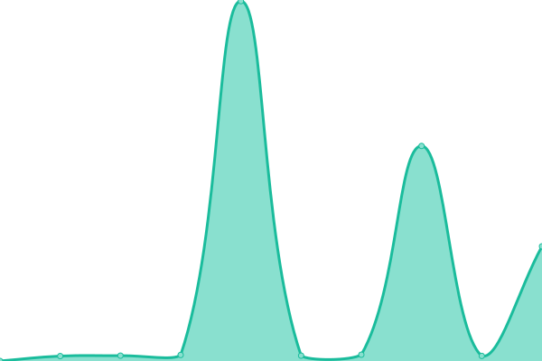
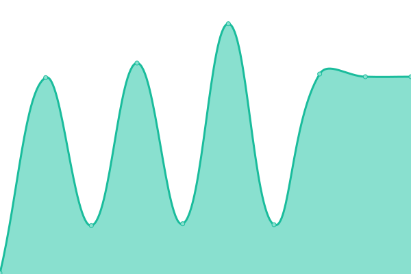

# [📈 Live Status](https://eyerate.github.io/statusPage): <!--live status--> **🟩 All systems operational**

This repository contains the open-source uptime monitor and status page for [EyeRate Inc.](www.eyeratebusiness.com), powered by [Upptime](https://github.com/upptime/upptime).

With [Upptime](https://upptime.js.org), you can get your own unlimited and free uptime monitor and status page, powered entirely by a GitHub repository. We use [Issues](https://github.com/eyerate/statusPage/issues) as incident reports, [Actions](https://github.com/eyerate/statusPage/actions) as uptime monitors, and [Pages](https://eyerate.github.io/statusPage) for the status page.

<!--start: status pages-->
<!-- This summary is generated by Upptime (https://github.com/upptime/upptime) -->
<!-- Do not edit this manually, your changes will be overwritten -->
<!-- prettier-ignore -->
| URL | Status | History | Response Time | Uptime |
| --- | ------ | ------- | ------------- | ------ |
|  Landing Page | 🟩 Up | [landing-page.yml](https://github.com/eyerate/statusPage/commits/HEAD/history/landing-page.yml) | 

 328ms
     
 | 

<a href="https://eyerate.github.io/statusPage/history/landing-page">100.00%</a>
    

|  Eyerate Reviews | 🟩 Up | [eyerate-reviews.yml](https://github.com/eyerate/statusPage/commits/HEAD/history/eyerate-reviews.yml) | 

 75ms
     
 | 

<a href="https://eyerate.github.io/statusPage/history/eyerate-reviews">100.00%</a>
    

|  Employee App | 🟩 Up | [employee-app.yml](https://github.com/eyerate/statusPage/commits/HEAD/history/employee-app.yml) | 

 257ms
     
 | 

<a href="https://eyerate.github.io/statusPage/history/employee-app">100.00%</a>
    

|  API | 🟩 Up | [api.yml](https://github.com/eyerate/statusPage/commits/HEAD/history/api.yml) | 

 237ms
     
 | 

<a href="https://eyerate.github.io/statusPage/history/api">71.01%</a>
    

|  Internal Support App | 🟩 Up | [internal-support-app.yml](https://github.com/eyerate/statusPage/commits/HEAD/history/internal-support-app.yml) | 

 221ms
     
 | 

<a href="https://eyerate.github.io/statusPage/history/internal-support-app">100.00%</a>
    

|  Endorser / Payments App | 🟩 Up | [endorser-payments-app.yml](https://github.com/eyerate/statusPage/commits/HEAD/history/endorser-payments-app.yml) | 

 222ms
     
 | 

<a href="https://eyerate.github.io/statusPage/history/endorser-payments-app">99.88%</a>
    

|  Employee App Development | 🟩 Up | [employee-app-development.yml](https://github.com/eyerate/statusPage/commits/HEAD/history/employee-app-development.yml) | 

 127ms
     
 | 

<a href="https://eyerate.github.io/statusPage/history/employee-app-development">100.00%</a>
    

|  Employee App Development Backend | 🟩 Up | [employee-app-development-backend.yml](https://github.com/eyerate/statusPage/commits/HEAD/history/employee-app-development-backend.yml) | 

 78ms
     
 | 

<a href="https://eyerate.github.io/statusPage/history/employee-app-development-backend">100.00%</a>
    

<!--end: status pages-->

[**Visit our status website →**](https://eyerate.github.io/statusPage)

## 📄 License

- Powered by: [Upptime](https://github.com/upptime/upptime)
- Code: [MIT](./LICENSE) © [EyeRate Inc.](www.eyeratebusiness.com)
- Data in the `./history` directory: [Open Database License](https://opendatacommons.org/licenses/odbl/1-0/)
